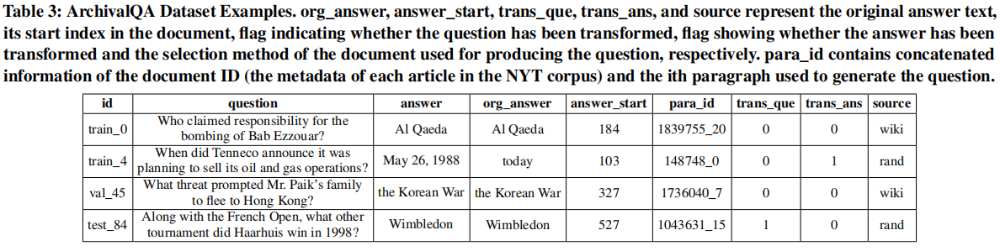

# Dataset

## ArchivalQA Dataset
The ArchivalQA dataset includes 532,444 question-answer pairs that were derived from 313,100 paragraphs of 88,431 news articles from NYT corpus. The entire dataset is divided into the training (80%, 425,956 examples), development (10%, 53,244 examples), and test set (10%, 53,244 examples), that can be downloaded [here](https://drive.google.com/drive/folders/15JMtkJAqtZsKr_P-0jH4iFy2EOri4GbR). The following figure shows few examples stored in the ArchivalQA dataset.

  

<!---
| id      | question                                                       | answer   | org_answer | answer_start | para_id    | trans_que | trans_ans | source |
|---------|----------------------------------------------------------------|----------|------------|--------------|------------|-----------|-----------|--------|
| train_0 | Who claimed responsibility for the bombing of Bab Ezzouar? | Al Qaeda | Al Qaeda | 184 | 1839755_20 | 0 | 0 | wiki |
| train_4 | When did Tenneco announce it was planning to sell its oil and gas operations? | May 26, 1988 | today | 103 | 148748_0 | 0 | 1 | rand |
|val_45 | What threat prompted Mr. Paik's family to flee to Hong Kong? | the Korean War | the Korean War | 327 | 1736040_7 | 0 | 0 | wiki |
|test_84 | Along with the French Open, what other tournament did Haarhuis win in 1998? | Wimbledon | Wimbledon | 527 | 1043631_15 | 1 | 0 | rand |
-->

## ArchivalQA Sub-datasets
Four ArchivalQA sub-datasets are also created, which we believe could be used for training/testing ODQA systems with diverse strengths and abilities. The sub-datasets can be downloaded [here](https://drive.google.com/drive/folders/1ITm9xmzmbI8yV9xLyojglcwOKl5GAuZX). More specifically, ArchivalQAEasy and ArchivalQAHard are constructed based on the difficulty levels of their questions, such that 100,000 are easy and another 100,000 are difficult questions. ArchivalQATime and ArchivalQANoTime are constructed based on the temporal characteristics of their questions, that contain 75,000 questions with temporal expressions and 75,000 without temporal expressions, respectively. The following figure shows few examples concisely for each of the four subdivisions.

  

## Baselines
We test three well-established ODQA approaches of different settings, that DrQA and BERTserini use sparse retrieval while DPR uses dense retrieval. The detailed information of ODQA approaches of different settings can be found in our paper. The following two figures show results of baselines on ArchivalQA dataset and four sub-datasets, respectively.

  

  

## A Tutorial of Using ArchivalQA for Training DPR Model
In this part, we give a tutorial of using ArchivalQA for training DPR model, which is a powerful dense passage retriever.

