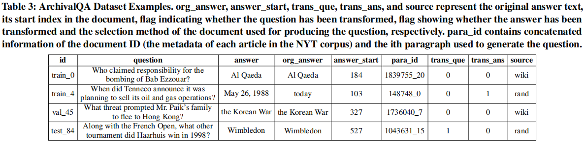
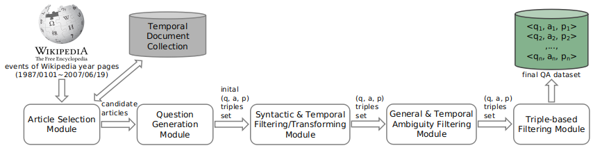

# ArchivalQA
This repository contains data and code for the SIGIR 2022 paper "ArchivalQA: A Large-scale Benchmark Dataset for Open Domain Question Answering over Archival News Collections", which consists of the ArchivalQA dataset, its four sub-datasets, a tutorial of using ArchivalQA, the code of the dataset-constructing framework, as well as other related training datasets used in the framework, etc.

## Dataset
The ArchivalQA dataset, as well as its four sub-datasets (ArchivalQAEasy, ArchivalQAHard, ArchivalQATime, ArchivalQANoTime) are available and can be downloaded [here](https://drive.google.com/drive/folders/15JMtkJAqtZsKr_P-0jH4iFy2EOri4GbR). Please check [Dataset](Dataset/) for more details, in which we also desribe the basic statistics, the sub-datasets, the results of baselines as well as instructions for using the ArchivalQA dataset.  The following figure shows few examples that stored in the ArchivalQA dataset.

  

## Dataset Generation Framework
The [Dataset_Generation_Framework](Dataset_Generation_Framework/) folder contains the processing code we used to create the ArchivalQA dataset. The following figure shows the architecture of the framework which consists of five modules: <em>Article Selection Module</em>, <em>Question Generation Module</em>, <em>Syntactic & Temporal Filtering/Transforming Module</em>, <em>General & Temporal Ambiguity Filtering Module</em> and <em>Triple-based Filtering Module</em>.

  

## Other Data
Other resources, including three training datasets that used in the dataset-constructing framework and the filtered ambiguous questions, are desribed in [Other_Data](Other_Data/) folder.
